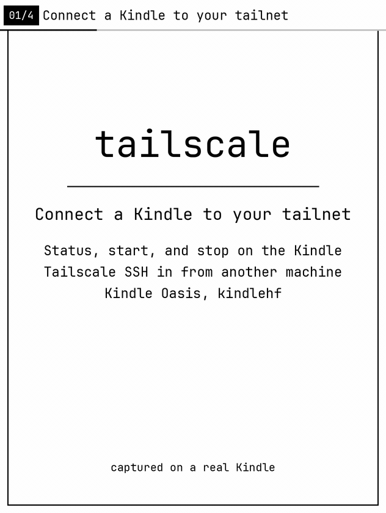

# tailscale

This KPM package connects a jailbroken Kindle to your Tailscale tailnet. It
adds a small Kindle control screen for connection status. From another
machine on the tailnet you can open a shell on the Kindle with Tailscale SSH.

It is an unofficial Kindle front-end, not a Tailscale Inc. product. The
`tailscale` and `tailscaled` programs it runs are the official binaries,
downloaded onto the device at install time.

It is for a jailbroken Kindle Oasis 10th generation (`kindlehf`, firmware
5.16.x) with [KPM](https://github.com/KindleModding/KPM) installed.



The demo is captured from a real Kindle Oasis. It shows the connected status
screen, Refresh, and how to open a shell with Tailscale SSH.

## Before you install

You need Wi-Fi during installation. The package downloads the official ARM
Tailscale binaries from `pkgs.tailscale.com` (about 33 MB); they are not stored
inside the `.kpkg`.

Create a reusable Tailscale auth key in the Tailscale admin console if you
want the package to recover automatically when the Kindle needs to log in
again. Choose an expiration that fits your tailnet's security policy. Treat
the key like a password.

## Install and connect

Install the `.kpkg` with KPM. The KPM command equivalent is:

```text
;kpm install tailscale
```

After installation, copy the auth key—nothing else—into:

```text
/mnt/us/tailscale/var/auth.key
```

Open **tailscale** from the Kindle Home screen and tap **Start** to connect.
The status panel changes to **Connected** after tailscale joins the tailnet.
Use **Stop** to disconnect and **Refresh** to refresh status.

Tailscale starts only when you request it. Installation, upgrades, opening
the app, and rebooting do not start the connection. If the daemon exits,
tap **Start** to reconnect. The control service remains available at boot
so the app can show status and handle Start/Stop.

The first successful connection saves the Kindle's node identity. Later starts
reuse that identity. If Tailscale reports that login is required, the package
tries the saved auth key automatically. A valid reusable key is needed for
this recovery. If the Kindle was deleted from the admin console, reauthenticating
registers it again as a new node.

## SSH into the Kindle

The default `up.args` includes `--ssh`. tailscaled accepts the session
itself; the package does not install an OpenSSH client or server. From
another machine on the tailnet, after the Kindle shows **Connected**:

```sh
tailscale ssh root@kindle
```

Your tailnet's SSH access rules must allow that login. The shell runs as
root. An `up.args` already on the Kindle is not replaced on upgrade; add
`--ssh` there if it is missing, then tap **Start** again.

## Storage and troubleshooting

Credentials, node state, settings, and logs live under
`/mnt/us/tailscale/var/` and survive upgrades. Back up that directory before a
Kindle reset. Do not share `auth.key` or `tailscaled.state`.

- Install completed but Start fails: reconnect Wi-Fi and reinstall so the
  official Tailscale binaries can download.
- Stuck at Checking or status is missing: reopen tailscale from Home to restart
  the control service.
- First connection fails: `auth.key` should be only the key (surrounding
  whitespace is ignored) and review `/mnt/us/tailscale/var/tailscaled.log`.
- Automatic re-login fails: check that `auth.key` contains a valid reusable
  key and review `/mnt/us/tailscale/var/start_log.txt` and
  `/mnt/us/tailscale/var/tailscaled.log`.

## For package builders

```sh
just test       # Rust unit tests and host end-to-end scenarios
just e2e        # WAF, status.json, and JSON escape; no Kindle
just demo       # host tests plus the real-Kindle tour
just demo-build # re-encode existing target/demo/frames
just toolchain
just package
```

`just test` needs Rust, Node, and Python 3. It does not cross-compile or link
`tsctl`, and it does not contact the Kindle. The single E2E entry point is
`tests/e2e/tailscale_e2e.py`. It provides a small page API for status
fixtures and, with `--record`, for Kindle taps and framebuffer screenshots.
Read the [E2E guide](docs/e2e.md) before adding a scenario.

`just package <package-version> <tailscale-version>` can also pin the official
Tailscale release downloaded at install time. KPM reinstalls only when the
package version changes; on reinstall, the package updates the downloaded
binaries when their recorded release differs from the pin.

`just demo` needs SSH to the Kindle (`KINDLE_E2E_HOST`, default `kindle`),
ffmpeg, and Pillow. The Kindle must already show Connected. The tour does not
tap Start or Stop. It writes frames under `target/demo/` and rendered files
under `dist/demo/`:

- `tailscale-demo.gif` — the README feature tour, copied to
  `docs/tailscale-demo.gif`.
- `tailscale-demo.mp4` — native Kindle-resolution video.
- `tailscale-demo-wide.mp4` — wide video for embeds.
- `tailscale-demo-poster.png` — poster frame.

Build with `just package X.Y.Z`, then attach
`dist/tailscale_X.Y.Z_kindlehf.kpkg` to the GitHub Release `vX.Y.Z` before
publishing it. The GitHub Action updates the KPM catalog with that asset's
download URL when the release is published, or when run manually. It skips
publishing if the `KINDLE_CATALOG_TOKEN` secret is missing.

`just publish [X.Y.Z]` publishes an existing release URL to the catalog;
the version defaults to `kpm/manifest.json`. Set `KINDLE_CATALOG_TOKEN` when
the catalog remote uses HTTPS. `TAILSCALE_RELEASE_REPO` overrides the default
release repository, `qingshan/tailscale`.

## Third-party code

The Rust sources, scripts, and WAF in this repository are MIT. See
[LICENSE](LICENSE). The UI font is not:

- `kpm/waf/fonts/JetBrainsMonoNerdFontMono-Regular.ttf` — JetBrains Mono
  patched by Nerd Fonts, SIL Open Font License 1.1. See `kpm/waf/fonts/OFL.txt`.

## License

MIT for this package's own code. See [LICENSE](LICENSE). The UI font keeps
the SIL Open Font License, linked above.
